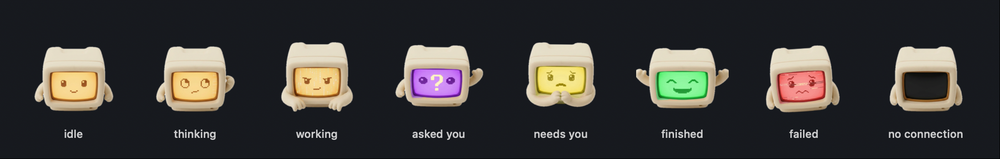
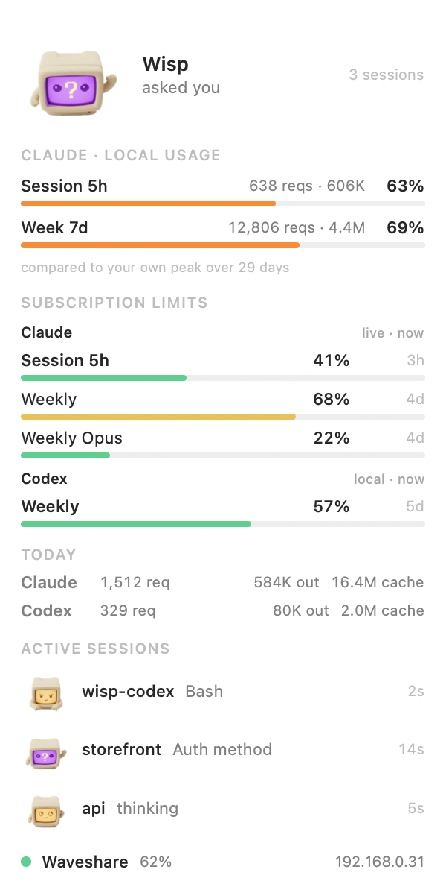
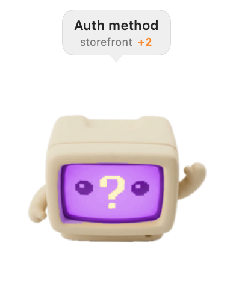

<p align="center">
  
</p>

<h1 align="center">Wisp AI</h1>

<p align="center">
  A mascot for Claude Code, with Claude and Codex usage in one place.
</p>

In your Mac's menu bar, and optionally on a small AMOLED screen sitting on your
desk.

Every active Claude session becomes a little character with its own state:
working, running a tool, waiting for your permission, asking you a question,
done, failed. When nothing is running the screen turns into a clock and a
weather forecast — a motionless character tells you nothing.

In the menu bar you get Claude and Codex usage, both providers' subscription
limits, and your open Claude sessions without leaving what you were doing.
Codex state hooks are not implemented yet; Codex support in this version is
usage and limits only.

<p align="center">
  
</p>

| the menu bar panel | on your desktop |
|---|---|
|  |  |

## Install

### On the Mac

```bash
curl -fsSL https://raw.githubusercontent.com/igouvea/wisp-codex/main/install.sh | bash
```

Or, if you would rather read it before running it — and you should:

```bash
git clone https://github.com/igouvea/wisp-codex.git
cd wisp-codex
./install.sh
```

You need macOS 14+ and Apple's command line tools (`xcode-select --install`).
Nothing else: the bridge runs on the Python that already ships with the
system, and the app has no dependencies at all.

The installer builds the app, installs it into `~/Applications`, generates
your token, asks whether it may register the Claude Code hooks — keeping a
copy of your `settings.json` first — and, if a board is plugged into USB,
offers to flash it right there. It never asks for `sudo`, installs nothing
globally and touches no system configuration.

**Why build instead of downloading a finished app:** an app downloaded from
the internet gets macOS's quarantine flag, and without a paid developer
signature the system refuses to open it with a malware warning. An app built
on your own machine never gets that flag. Building here is what *removes* the
friction, not the opposite — and you get to read what you are running.

### On the board (optional)

The app works on its own. The little screen is the extra. With the board
plugged into USB:

```bash
./flash.sh
```

One command: it finds the board, saves Waveshare's factory firmware (which you
cannot get back afterwards — it is not distributed anywhere), flashes Wisp and
asks for your WiFi. The password is typed hidden and goes straight into the
NVS partition along with the bridge token; it never passes through the source
or through git.

**You do not need ESP-IDF.** The binaries come ready from the GitHub release,
and the two flashing tools (`esptool` and the NVS generator) are pulled from
PyPI into a venv under `~/.wisp/tools` the first time — about 15MB, and they
run on the Python 3.9 that macOS itself already ships. If you have a local
build in `firmware/build/`, it uses yours instead of downloading.

Building the firmware does require ESP-IDF 5.5 — but that only matters if you
are going to change it. See [firmware/README.md](firmware/README.md).

```bash
./flash.sh --no-wifi      # firmware only; provision later
./flash.sh --erase        # erase the flash first (board stuck in a boot loop)
```

Hardware: **Waveshare ESP32-S3-Touch-AMOLED-2.16** (480×480, touch,
accelerometer). Swiping sideways brings up the usage panel; turning the device
rotates the image with it. It only speaks 2.4GHz WiFi.

## What it does on your machine

Transparency matters here, because the app reads your coding-agent data:

| what | where | why |
|---|---|---|
| reads Claude transcripts | `~/.claude/projects/**/*.jsonl` | counting Claude requests and tokens |
| reads Codex transcripts | `~/.codex/sessions/**/*.jsonl` and `~/.codex/archived_sessions/*.jsonl` | counting Codex requests and tokens, and reading Codex's rate-limit snapshots |
| reads the limits cache | `~/.claude.json` | the subscription percentages |
| appends hooks | `~/.claude/settings.json` | knowing what Claude is doing |
| writes configuration | `~/.wisp/config.json` | token, port, city |
| copies the hook | `~/.wisp/hook.sh` | so you can delete the clone afterwards |
| flashing tools | `~/.wisp/tools/` | only if you flash the board |
| runs the bridge | `0.0.0.0:4666` | the board can fetch state over WiFi; non-local clients need Wisp's token |

The hooks are appended to yours, never written over them, and the file is
copied first. `bridge/install_hook.py --dry-run` shows what would change;
`--remove` undoes it.

There is no Wisp telemetry and no server of ours. Codex usage is read entirely
from local transcripts; Wisp does not send an OpenAI credential or call an
OpenAI endpoint. The outbound connections are the weather forecast (Open-Meteo,
no signup), discovering your city from your IP once at install time, and the
optional live Claude limit fetch to Anthropic described below.

### About the network

The bridge listens on the local network because the board has to reach it.
That is why it demands a **token** from anything coming from outside —
generated on its own at install time and written to the board along with the
WiFi. Without it, anyone on the same network could read your project names and
your usage.

If you have a board flashed before this existed, `require_token: false` in the
config keeps it working, and the app shows a yellow warning until you reflash.

## Subscription limits

The limits panel groups providers instead of adding unlike percentages
together. A Claude weekly percentage and a Codex weekly percentage have
different denominators; combining them would produce a precise-looking number
with no meaning.

### Claude

The app fetches the percentages **straight from Anthropic**, on the same
endpoint Claude Code uses (`GET /api/oauth/usage`). It refreshes after usage,
never more often than every 10 minutes, with an hourly idle ceiling unless
Anthropic has asked it to back off. They are the same numbers you see in Claude
Code's usage panel, without depending on you opening it.

For that it needs the Claude Code credential, which lives in the macOS
keychain. **macOS is the one who decides**: the first time, a dialog appears
asking for your authorization. The token never leaves your machine — it goes
in a header to `api.anthropic.com` and nowhere else, and the bridge never even
sees it.

If you decline, nothing breaks: the option turns itself off (we do not nag),
and the app falls back to the cache Claude Code keeps in `~/.claude.json`.
That cache has a 5-minute deadline, but **it is only rewritten when something
triggers a fetch** — on a test machine it sat unchanged for three days because
nobody opened the usage panel. When the cache is the source, the app shows its
age next to the number and dims it, instead of presenting stale data as if it
were current.

You can turn the fetching off at any time under **Fetch real limits** in the
panel.

### Codex

Codex writes the server-provided `used_percent`, reset time and window length
into `token_count` events in its local session transcripts. Wisp reads the
newest event and shows each available Codex window. It never estimates the
percentage from tokens and needs no OpenAI credential or network request.

The panel labels this source `local` and shows its age. After five minutes it
dims the bar: another Codex instance could have consumed usage that this Mac's
transcripts cannot see. Once a recorded reset passes, Wisp shows the window as
expired instead of continuing to display a percentage known to describe the
previous window.

### Usage computed locally

Independently of all that, the app computes Claude usage from its transcripts
over the same windows (5h and 7 days) and compares it against your own Claude
peak of the last 30 days. Today's totals are shown separately for Claude and
Codex. None of those local counts needs a credential or a network request.

## Next steps

Ideas worth doing, roughly in the order they earn their keep. Nothing here is
promised.

**Support agents other than Claude Code.** The architecture already allows it:
`hook.sh` only POSTs the event to `127.0.0.1:4666/hook`, and the whole state
machine lives in the bridge. Adding an agent means mapping its events onto the
seven states.

- [ ] **Codex CLI state** — usage and exact rate-limit windows already work.
      Session state still needs a supported Codex event adapter before Codex
      sessions can become mascots; this repository does not claim that part is
      done.
- [ ] **Cursor** — feasible with a translation layer. The vocabulary is
      different (`beforeShellExecution`, `beforeMCPExecution`,
      `beforeReadFile`, `afterFileEdit`, `stop`), so *tool*, *working* and
      *done* map cleanly, *waiting for permission* comes out of
      `beforeShellExecution`, and there is no session-start event — the
      session would have to be born on the first event it sees. Hooks are
      configured per project in `.cursor/hooks.json`.
- [ ] **Gemini CLI and others** — not investigated yet.
- [ ] One mascot per agent, so a screen with mixed sessions still tells you
      *which* tool is doing what.

**Making the board easier still.**

- [ ] Flash from the browser with [ESP Web Tools](https://esphome.github.io/esp-web-tools/)
      — WebSerial in Chrome/Edge, no terminal at all.
- [ ] Over-the-air updates, so new firmware does not mean plugging in a cable.
- [ ] A first-boot SoftAP portal as a fallback for WiFi provisioning.

**Elsewhere.**

- [ ] Linux support for the bridge (the board side is already portable; the
      port is just `/dev/ttyACM0`).
- [ ] A ready-made mascot pack, so the vector character is a choice and not
      the only option. See [MASCOTS.md](MASCOTS.md).

## Uninstall

```bash
/usr/bin/python3 bridge/install_hook.py --remove   # removes the hooks
rm -rf ~/Applications/Wisp.app ~/.wisp
```

Everything Wisp creates lives under those two paths. `--remove` also clears
entries from an older install that pointed at the clone, and keeps a backup
first.

## License

MIT.
